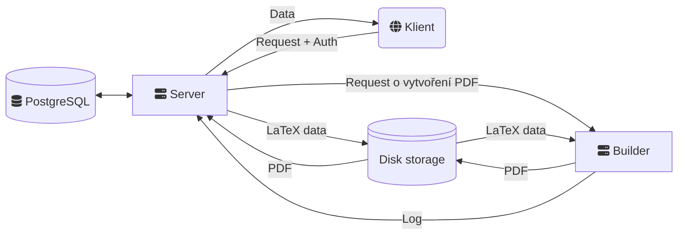

# Problem manager

Systém pro správu úloh v korespondenčních seminářích.

## Architektura

Aplikace je vytvořena jako standardní třívrstvá architektura s výjimkou
oddělení builderu PDF do samotné service, aby bylo možné builder provozovat,
vyvíjet a verzovat mimo server.

## Spuštění

### Instalace balíčků

Pro nainstalování je třeba spustit `npm install`. Ten nainstaluje `node_modules`
jak do jednotlivých složek, tak hlavně do root složky, kde se nachází sdílené
balíčky. Ty se nainstalují, protože jsou nastaveny `workspaces`, aby byla
zajištěna stejná verze balíčků mezi klientem a serverem.

### Lokální vývoj

Hlavní složka obsahuje `docker-compose.yml` definující docker kontejnery pro
lokální vývoj. Před spuštěním je však potřeba zkopírovat soubor
`config.json.sample` do `config.json` ve složce `server`, aby existovala
konfigurace serveru + v ní doplnit potřebné údaje, hlavně `oidcCertsUrl`.

Nastavení klienta je podobné, v něm je třeba zkopírovat `.end.development.sample`
do `.end.development` a vyplnit údaje pro OIDC.

Následně stačí spustit `docker compose build` a `docker compose up` pro spuštění
systému. Pro spuštění příkazů v prostředí serveru je možné spustit command line
v dockeru přes `docker exec -it problem-manager-server-1 bash`. Zde je následně
možné např. inicializovat schéma databáze přes `npm run db:push` nebo vytvořit
mock data přes spuštění `npx tsx src/db/seed.ts`.

### Produkční nasazení

Pro produkční nasazení je možné použít `docker-compose.prod.yml`. Aby jej
bylo možné použít, je opět třeba vykopírovat `config.json.sample`, tentokrát
tak, aby se nacházel ve stejné složce, jako docker compose. Také je třeba
změnit přístupové údaje k databázi, aby zde nezůstali výchozí hesla a přidat
nastavení klienta přes ENV proměnné.

Aby se dalo ke kontejnerům připojit, je třeba také dokonfigurovat reverse proxy
nebo přidat port mapping.

### Keycloak auth

Aplikace počítá s tím, že se do ní přihlašuje přes OIDC, přesněji Keycloak.
V něm je potřeba vytvořit _public klienta_, přes kterého bude probíhat
autentifikace.

Aplikace následně hledá uživatele dle atributu `person_id`, který musí Keycloak
exportovat. Proto je potřeba přidat `token mapper` typu `user attribute`
v záložce `problem-manager-dedicated`, který exportuje uživatelský atribut
`fksdb-id` jako `person_id`.
